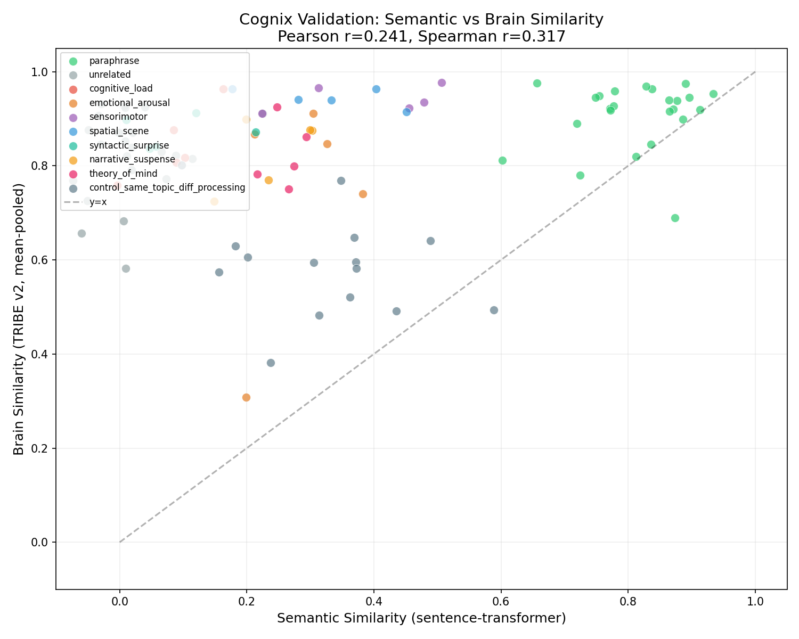

# Cognix

Research into brain-grounded cognitive fingerprints. The question: **can predicted brain responses be turned into useful representations that capture something standard embeddings miss?**

Standard embeddings tell you what content is about. They don't tell you how cognitively demanding it is, what emotions it triggers neurally, or whether it activates motor circuits. [Meta's TRIBE v2](https://github.com/facebookresearch/tribev2) predicts fMRI brain responses from text, audio, and video. Cognix investigates the optimal way to turn those brain tensors into fingerprints for downstream tasks.

## Pipeline

```
input -> TRIBE v2 -> brain tensor (T, 20484) -> fingerprint -> downstream tasks
```

The fingerprinting method is the research question. The brain tensor's 20,484 vertices map to a standard brain atlas (fsaverage5), potentially enabling region-specific signal extraction — but this must be verified empirically, not assumed.

## Why this is interesting

Two texts can be semantically unrelated but cognitively similar:

| Text A | Text B | Semantic sim | Brain sim |
|--------|--------|-------------|-----------|
| Dense legal clause | Dense math proof | 0.087 | 0.845 |
| Soldier watching a friend die | Reading a terminal diagnosis | 0.285 | 0.735 |
| Kicking a ball | Stomping on a brake pedal | 0.396 | 0.942 |
| Vast empty desert | Open ocean, no land in sight | 0.329 | 0.944 |

Round 1 validation (100 pairs) showed Pearson r = 0.24 between brain similarity and semantic similarity — barely correlated. All 7 divergence categories diverge in the predicted direction.



## Open questions

1. **Does the brain mapping add value beyond LLaMA?** TRIBE's text pathway uses LLaMA 3.2 internally. If raw LLaMA embeddings show the same divergence, the brain mapping adds nothing. This is the critical test — Phase 2 includes a direct LLaMA baseline.

2. **Can the high baseline be resolved?** Mean-pooled brain vectors have ~0.82 cosine similarity even for unrelated texts. Baseline removal (mean-centering, z-scoring) is required before any similarity or axis extraction.

3. **Are the vertex predictions spatially meaningful?** If TRIBE's predictions are region-accurate, we can extract cognitive axes (prefrontal = load, limbic = emotion, motor cortex = motor). If not, we fall back to whole-brain methods.

## If it works

Potential applications: cognitive readability scoring, brain-grounded content recommendation, cross-topic emotional arousal detection, AI alignment benchmarking. If region decomposition works, multi-axis cognitive profiles per text.

## How Cognix differs from related work

| System | Direction | What it captures |
|--------|-----------|-----------------|
| Sentence-transformers | text -> embedding | Semantic meaning |
| BrainCLIP | real fMRI -> CLIP space | Brain decoding ("what were they looking at?") |
| MindEye2 | real fMRI -> image | Image reconstruction |
| **Cognix** | text -> predicted brain response -> fingerprint | Cognitive processing characteristics |

BrainCLIP needs a real brain scan. Cognix predicts the brain response from content. Different direction entirely.

## Current status

**Phase 2 (in progress):** Scaling to 1,000 pairs with LLaMA baseline, random baseline, and adversarial pairs. See [design doc](cognitive_similarity_embedding_system_design_v2.md) for full roadmap.

## Running the validation experiment

Requires Google Colab with A100 GPU (free for students via [Colab Pro](https://colab.research.google.com/signup)).

1. Add your [HuggingFace token](https://huggingface.co/settings/tokens) as a Colab secret named `HF_TOKEN` (requires access to [meta-llama/Llama-3.2-3B](https://huggingface.co/meta-llama/Llama-3.2-3B))
2. Open `notebooks/00_validation_experiment.ipynb` from GitHub in Colab
3. Set runtime to **A100 GPU + High RAM**
4. Run all cells

## Built with

| Provider | What we use | Role |
|----------|------------|------|
| **Meta** | [TRIBE v2](https://github.com/facebookresearch/tribev2), [LLaMA 3.2](https://huggingface.co/meta-llama/Llama-3.2-3B) | Brain response prediction, text features |
| **Google** | [Colab](https://colab.research.google.com), [gTTS](https://pypi.org/project/gTTS/) | GPU compute, text-to-speech |
| **OpenAI** | [Whisper](https://github.com/openai/whisper) (via [WhisperX](https://github.com/m-bain/whisperX)) | Timestamp extraction |
| **Hugging Face** | [Transformers](https://huggingface.co/docs/transformers), [sentence-transformers](https://www.sbert.net/) | Model hosting, semantic baseline |

## License

Depends on TRIBE v2 ([CC BY-NC 4.0](https://creativecommons.org/licenses/by-nc/4.0/)). **Non-commercial use only.**
